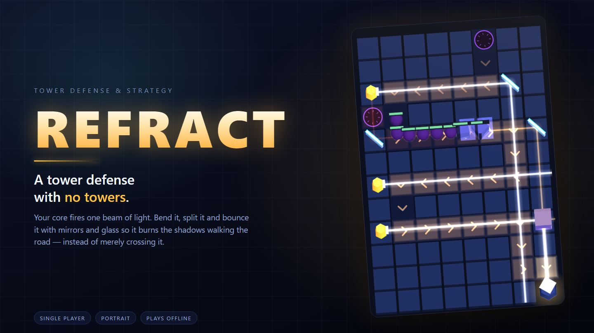
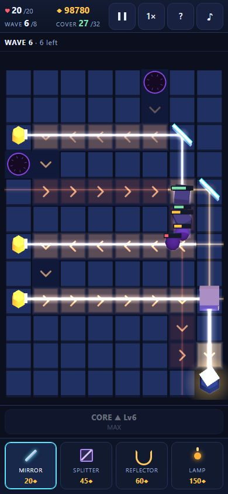
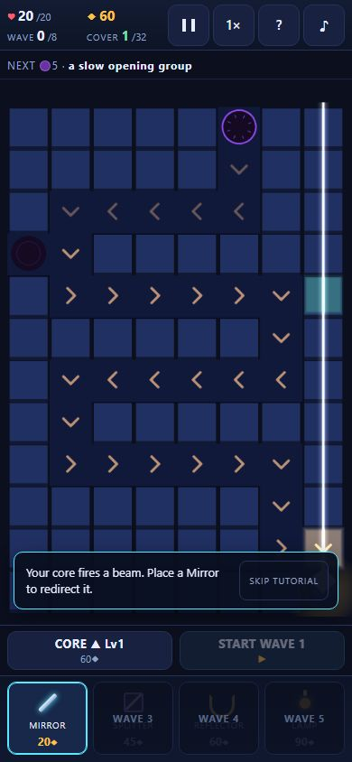

<div align="center">



**A tower defense with no towers.**

Your core fires one beam of light. Bend it, split it and bounce it with mirrors
and glass so it burns the shadows walking the road — instead of merely crossing it.

Single player · Portrait · Runs offline from one HTML file

</div>

---

## What it is

REFRACT is a browser tower-defense game built for phones. There are no turrets to
place. The Lumen Core at the bottom of the board fires a single beam north, and
everything you build only ever bends, splits, reflects or re-lights that beam.

Anything standing in the light takes damage for as long as it stays there, so the
whole game is a routing problem: light **along** a road burns for the length of the
segment, light **across** it burns for one cell.

| | |
|---|---|
|  |  |
| A developed network mid-encounter: mirrors on the trunk, lamps down the left, a splitter feeding two branches. | The first-run walkthrough. It marks a tile, asks for one action, and gets out of the way. |

## The two ideas it is built on

**Absorption.** Every body the light passes through takes a bite out of it, so the
ones behind take less. A tight formation shields its own back rank, and the beam
visibly thins and reddens past each shadow it crosses.

**Facing.** A Bulwark carries its shield on the face it walks towards. Light meeting
that face is mostly turned away; light reaching its flank or its back lands in full.
The same three mirrors are therefore right or wrong depending on which way everyone
is walking — which is what makes a second entrance onto the board matter.

## Playing

- **Tap** a tile to place the selected piece; **tap** a placed piece to rotate, move or sell it; **drag** to reposition.
- **Nothing starts until you tap START WAVE.** Planning is untimed, and rearranging or selling while you plan is free and fully refunded.
- Four tools unlock as they become useful: **Mirror** (90° turn, no loss), **Splitter** (straight *and* bent, half power each), **Reflector** (a 60% return pass from the other direction), **Lamp** (an independent second source).
- After encounters 2 and 5 the run stops and offers a choice of three run upgrades.
- Eight encounters, roughly five minutes. Beat Umbra to win — surviving it is not enough. Endless mode continues afterwards for score.

## Running it

```bash
node tools/serve.js          # dev server on :8080, rebuilds index.html per request
node tools/serve.js 8080 0.0.0.0   # reachable from a phone on the same network
```

Test it at a portrait viewport — 390 × 844 with touch emulation. The layout is fixed
portrait; a desktop window shows the same column centred.

```bash
node tools/build.js          # release index.html, no debug code
node tools/check.js          # compliance checks
node tools/test-beam.js      # headless solver tests
node tools/package.js        # everything above, then dist/
node tools/qa.js list        # browser scenarios
node tools/qa.js <scenario>  # run one
```

## How it is built

Plain HTML, CSS and classic-script JavaScript, with Three.js r149 for rendering.
No modules, bundler, framework, minifier or build-time transpiler.

- `src/NN_name.js` — one namespace object `R`; load order is filename order. `tools/build.js` inlines every source file and the stylesheet into a single readable `index.html`.
- **No network at runtime.** The finished page makes exactly two requests: itself and `vendor/three.min.js`. Every texture is drawn to a canvas at load; all audio is synthesised with Web Audio. It runs with the network off.
- **Fixed-timestep simulation.** Rendering only ever reads state; feedback reaches the renderer, HUD and audio through an event queue, so behaviour is identical at any refresh rate and reproducible from a seed.
- Everything created per wave is pooled. `localStorage` and `AudioContext` are both guarded — the game runs without either.

```
src/     00 config · 01 util · 02 audio · 03 state · 04 grid · 05 beam
         06 enemies · 07 pieces · 08 render · 09 ui · 10 input · 11 game
tools/   build, serve, check, package, and the test drivers
docs/    design intent, images
```

## Tests

26 headless tests cover the beam solver directly — reflection, splitting, return
passes, absorption ordering within a cell, loop termination, segment caps and
determinism.

On top of that, 25 scripted browser scenarios drive the real game through touch
events at phone viewports, checking layout at 360×640 through 430×932, the wave
and economy rules, the shield geometry, both endings, the upgrade offers, the
walkthrough, and a full run played to a win with nothing but taps. Every scenario
also asserts that the page made no unexpected network requests and logged nothing
to the console.

```bash
node tools/test-beam.js
node tools/qa.js acceptance
```

## Credits

Three.js is bundled unmodified under `vendor/`, with its licence alongside it.
Everything else here — the solver, the renderer, the art, the audio and the tools —
is written for this project.
